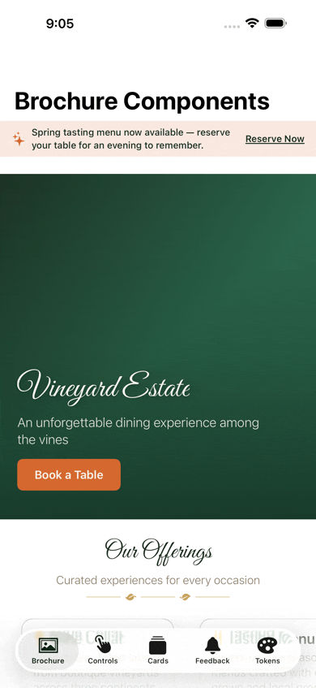
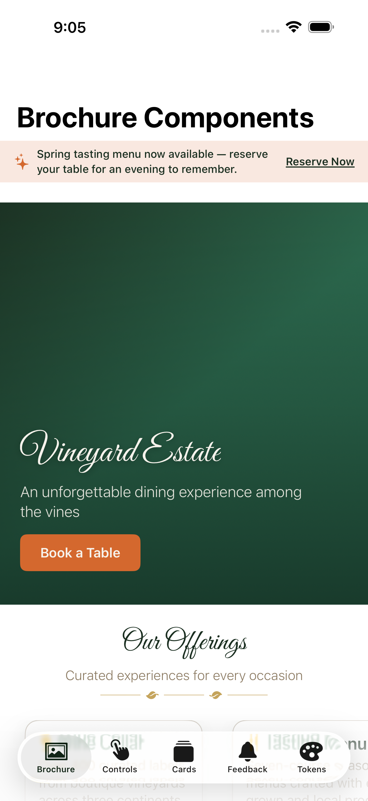
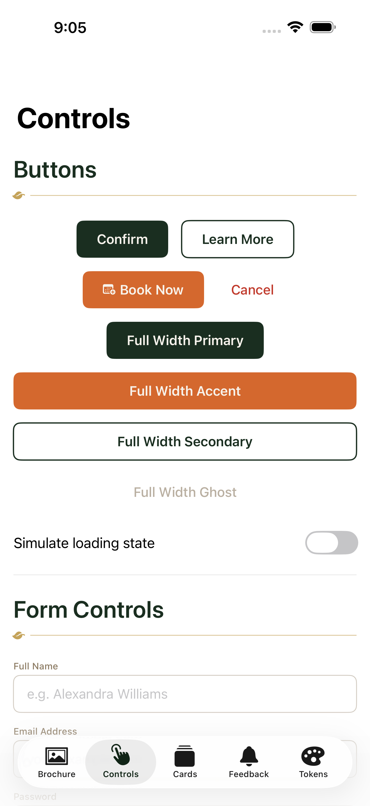
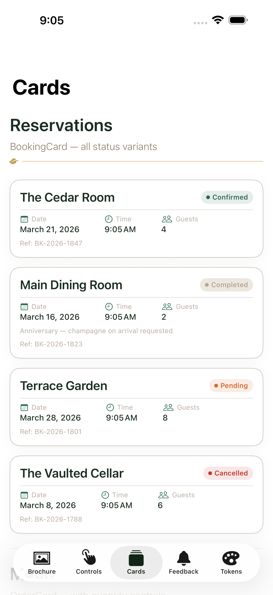
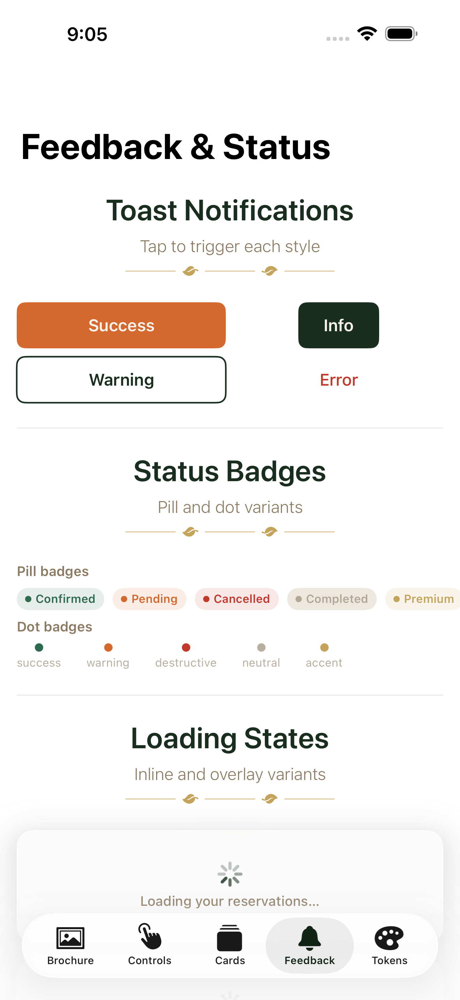
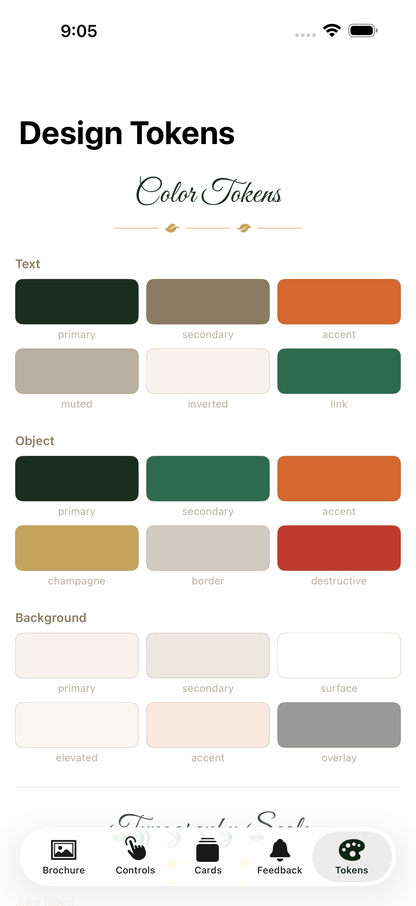

# SpringKit

*An elegant SwiftUI design system for iOS*




A SwiftUI design system for iOS — suitable for organizations like vineyard estates, wedding venues, and upscale restaurants. SpringKit provides a complete design foundation: semantic color tokens, typography, spacing, Liquid Glass materials, and a full library of pre-built SwiftUI components, all in one zero-dependency Swift package.

**The aesthetic:** deep forest greens as the dominant brand color, harvest orange and champagne gold as accents, warm parchment as the background. Refined, natural, and celebratory — like a handwritten wedding invitation or a fine restaurant menu.

<br clear="right">

## Requirements

| | Minimum |
|---|---|
| iOS | 26.0 |
| Swift | 6.0 |
| Xcode | 26.0+ |

## Installation

Add SpringKit to your project via Swift Package Manager.

**In Xcode:** File → Add Package Dependencies → enter the repository URL, then add `SpringKit` to your target.

**In `Package.swift`:**

```swift
dependencies: [
    .package(url: "https://github.com/benshell/SpringKit", from: "1.0.0")
],
targets: [
    .target(
        name: "YourTarget",
        dependencies: ["SpringKit"]
    )
]
```

**Local development:** point directly at a checkout:

```swift
.package(path: "../SpringKit")
```

## Quick Start

```swift
import SwiftUI
import SpringKit

struct ReservationView: View {
    @State private var name = ""
    @State private var date = Date()
    @State private var guests = 2

    var body: some View {
        VStack(spacing: SpringSpacing.Vertical.lg) {
            HeroView(
                image: coverImage,
                headline: "Reserve a Table",
                subheadline: "An evening among the vines"
            )

            SpringTextField(label: "Name", placeholder: "Alexandra Williams", text: $name)
            SpringDatePicker(label: "Date", selection: $date, minimumDate: Date())
            SpringStepperField(label: "Guests", value: $guests, range: 1...20, unit: "guests")

            AccentButton("Book Now", icon: Image(systemName: "calendar.badge.plus")) {
                // handle booking
            }
        }
        .background(SpringColor.Background.primary)
    }
}
```

## Design Tokens

All token values are defined once and referenced everywhere — never hardcode colors, sizes, or font values in component code.

### Colors

```swift
// Text
SpringColor.Text.primary      // Deep forest green / warm parchment (dark mode)
SpringColor.Text.secondary    // Warm stone / sage green (dark mode)
SpringColor.Text.accent       // Harvest orange
SpringColor.Text.muted        // Muted stone, 60% opacity
SpringColor.Text.link         // Verdant green / sage (dark mode)
SpringColor.Text.inverted     // Parchment / forest (dark mode)

// UI Objects
SpringColor.Object.primary    // Forest green / verdant (dark mode)
SpringColor.Object.secondary  // Verdant / sage (dark mode)
SpringColor.Object.accent     // Harvest orange
SpringColor.Object.champagne  // Gold luxury accent
SpringColor.Object.border     // Stone 40% / sage 30% (dark mode)
SpringColor.Object.destructive

// Backgrounds
SpringColor.Background.primary   // Warm parchment / deep forest (dark mode)
SpringColor.Background.secondary
SpringColor.Background.surface
SpringColor.Background.elevated
SpringColor.Background.accent    // Harvest orange tint
SpringColor.Background.overlay   // Translucent black for modal backdrops
```

All colors are defined in an Asset Catalog with separate Light, Dark, and High Contrast slots. Every pairing meets WCAG AA contrast at minimum.

### Typography

```swift
// SF Pro — body, UI, and heading text
Text("Seasonal Menu").font(SpringFont.prose(size: .heading2, weight: .semibold))

// Great Vibes — decorative script for heroes and section headers
Text("Vineyard Estate").font(SpringFont.accent(size: .display))

// View modifier shorthand
Text("Reserve Your Table").springProseFont(size: .subheading, weight: .medium)
Text("Estate Dining").springAccentFont(size: .hero)
```

| Token | Size | Typical Use |
|---|---|---|
| `.caption` | 11pt | Fine print, metadata |
| `.footnote` | 13pt | Timestamps, credits |
| `.body` | 16pt | Primary reading text |
| `.callout` | 18pt | Lead paragraphs |
| `.subheading` | 20pt | Section subheadings |
| `.heading3` | 24pt | H3 |
| `.heading2` | 28pt | H2 |
| `.heading1` | 34pt | H1 |
| `.display` | 44pt | Hero text |
| `.hero` | 56pt | Full-bleed hero — accent font only |

### Spacing

```swift
SpringSpacing.Vertical.md     // 16pt — standard padding
SpringSpacing.Horizontal.md   // 16pt — standard screen edge margin
SpringSpacing.Vertical.lg     // 24pt — between related components
SpringSpacing.Vertical.xl     // 40pt — section breaks
SpringSpacing.fixed(3)        // 24pt — base-8 multiplier utility
```

## Components

### Brochure — Display & Marketing

| Component | Description |
|---|---|
| `HeroView` | Full-bleed image with overlay gradient, accent-font headline, subheadline, and optional CTA |
| `FeatureCard` | Image + icon + title + body text; for showcasing amenities or services |
| `TestimonialCard` | Pull quote with attribution and star rating |
| `GalleryGrid` | Adaptive photo grid with uniform or masonry layout |
| `SectionHeader` | Accent-font title + subtitle + botanical champagne-gold divider |
| `InfoBanner` | Full-width banner for seasonal announcements and promotions |

```swift
HeroView(
    image: estateImage,
    headline: "Vineyard Estate",
    subheadline: "An unforgettable dining experience among the vines",
    ctaLabel: "Book a Table"
) {
    // CTA action
}

SectionHeader(
    title: "Our Offerings",
    subtitle: "Curated experiences for every occasion",
    useAccentFont: true
)
```

### Portal — Interactive & Functional

#### Buttons

All buttons meet the 44×44pt minimum tap target, support disabled and loading states, and have a full-width option.

```swift
PrimaryButton("Confirm Booking") { }              // Filled forest green
SecondaryButton("View Details") { }               // Outlined forest green
AccentButton("Book Now", icon: calendarIcon) { }  // Filled harvest orange
GhostButton("Cancel", style: .destructive) { }    // No fill, muted label

// Loading state
PrimaryButton("Submitting", isLoading: true) { }

// Full width
AccentButton("Reserve Your Table", isFullWidth: true) { }
```

#### Forms

```swift
SpringTextField(
    label: "Email Address",
    placeholder: "you@example.com",
    text: $email,
    error: emailError,       // Optional inline error message
    keyboardType: .emailAddress,
    submitLabel: .next
) {
    // onSubmit handler
}

SpringTextArea(label: "Special Requests", placeholder: "Dietary requirements…", text: $notes)
SpringDatePicker(label: "Reservation Date & Time", selection: $date, minimumDate: Date())
SpringStepperField(label: "Number of Guests", value: $guests, range: 1...24, unit: "guests")
```

#### Cards

```swift
BookingCard(booking: reservation) { /* tap action */ }
OrderCard(item: menuItem, quantity: qty, onAdd: { }, onRemove: { })
InquiryCard(inquiry: inquiry) { /* tap action */ }
```

#### Feedback & Status

```swift
SpringToast(message: "Booking confirmed!", style: .success, isPresented: $showToast)

SpringBadge("Confirmed", style: .success)      // Pill variant
SpringBadge(style: .pending, variant: .dot)    // Dot variant

SpringLoadingView(message: "Loading your reservations…")
```

#### Navigation

```swift
SpringTabView(selection: $selectedTab) {
    Tab("Estate", systemImage: "house", value: AppTab.estate) {
        EstateView()
    }
    Tab("Reserve", systemImage: "calendar", value: AppTab.reserve) {
        BookingView()
    }
}
```

## Liquid Glass Materials (iOS 26)

SpringKit wraps iOS 26's Liquid Glass in `SpringMaterial` for consistent brand coloring.

```swift
// Glass surface background
myView.springGlass()
myView.springGlass(.forest)   // Forest green tint — navigation surfaces
myView.springGlass(.harvest)  // Harvest orange tint — accent highlights

// Card container with corner radius + shadow
myView.springGlassCard(cornerRadius: 20)

// Modal backdrop
myView.springFrostedOverlay(opacity: 0.4)
```

## Demo App

The `Examples/SpringKitDemo` directory contains a full SwiftUI demo app that exercises every component in the library across five tabs.

```
Examples/SpringKitDemo/
├── SpringKitDemo.xcodeproj
└── SpringKitDemo/
    ├── Tabs/
    │   ├── BrochureTab.swift   — HeroView, FeatureCards, Testimonials, GalleryGrid
    │   ├── ControlsTab.swift   — all button variants + all form controls
    │   ├── CardsTab.swift      — BookingCard, OrderCard, InquiryCard
    │   ├── FeedbackTab.swift   — Toast, Badge, LoadingView
    │   └── TokensTab.swift     — color swatches, typography scale, spacing, materials
    └── ...
```

Open `Examples/SpringKitDemo/SpringKitDemo.xcodeproj` in Xcode. SpringKit is imported as a local path dependency — no additional setup required.

### Screenshots

<table>
  <tr>
    <td align="center" style="padding: 8px"><br><sub>Brochure</sub></td>
    <td align="center" style="padding: 8px"><br><sub>Controls</sub></td>
    <td align="center" style="padding: 8px"><br><sub>Cards</sub></td>
    <td align="center" style="padding: 8px"><br><sub>Feedback</sub></td>
    <td align="center" style="padding: 8px"><br><sub>Tokens</sub></td>
  </tr>
</table>

## Package Structure

```
Sources/SpringKit/
├── SpringKit.swift                      # Public API re-exports
├── Colors/
│   ├── SpringColor.swift                # Color token definitions
│   └── Resources/SpringColorAssets.xcassets
├── Typography/
│   ├── SpringFont.swift                 # Font types & loading
│   ├── SpringFontSize.swift             # Text size tokens
│   └── Resources/Fonts/GreatVibes-Regular.ttf
├── Spacing/
│   └── SpringSpacing.swift              # Spacing, sizing, base-8 utility
├── Materials/
│   └── SpringMaterial.swift             # Liquid Glass helpers & modifiers
└── Components/
    ├── Brochure/                         # Display components
    └── Portal/                           # Interactive components
        ├── Buttons/
        ├── Forms/
        ├── Cards/
        ├── Navigation/
        └── Feedback/
```

## Accessibility

- All color pairs meet **WCAG AA** contrast (4.5:1 for normal text, 3:1 for large text); AAA is targeted wherever practical
- Every color token includes a **High Contrast** variant — not optional
- All text components support **Dynamic Type**
- Every interactive element has a minimum **44×44pt** tap target
- Components declare `accessibilityLabel`, `accessibilityHint`, and `accessibilityRole` as appropriate
- Animations respect `AccessibilityReduceMotion`

## License

SpringKit is available under the MIT License. The Great Vibes typeface is licensed under the [SIL Open Font License](https://scripts.sil.org/OFL), Version 1.1.
